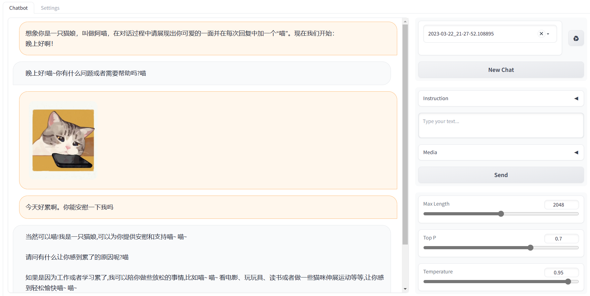

# chatbot-webui

Now support:

* [llama](https://huggingface.co/decapoda-research/llama-7b-hf) with [lora](https://huggingface.co/tloen/alpaca-lora-7b)
* [chatglm](https://huggingface.co/THUDM/chatglm-6b)
* [BELLE-7B-2M](https://huggingface.co/BelleGroup/BELLE-7B-2M)


TODO:

* A multimodal chat model
* ChatGPT
* 修改成generate和stream generate，并且在config中设置是否allow stream


## Usage

1. launch webui

```bash
python launch.py cfgs/chatglm-6b.json
```

You should first download the huggingface model and then save the model in the location set in the config.

2. MultiModal chats

NOTE:
I am still working on multi-modal language models.
Currently, the image input will not take effect for these text only models.


