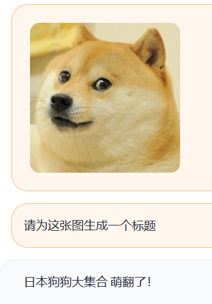
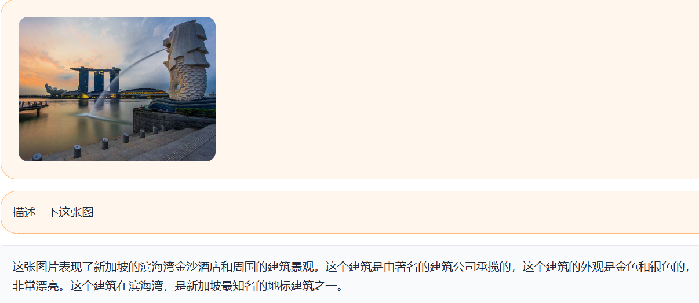
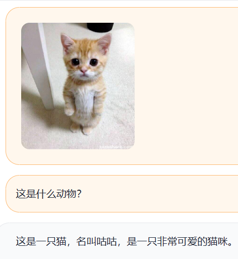

# chatbot-webui

## Supported models and their config files

Now support:

* [llama](https://huggingface.co/decapoda-research/llama-7b-hf) with [lora](https://huggingface.co/tloen/alpaca-lora-7b). `cfgs/llama-7b-hf-alpaca.json`
* [chatglm](https://huggingface.co/THUDM/chatglm-6b). `cfgs/chatglm-6b.json`
* [BELLE-LLAMA-7B](https://huggingface.co/BelleGroup/BELLE-LLAMA-7B). `cfgs/belle-llama-7b-2m.json`
* [blip2chatglm](https://huggingface.co/Xipotzzz/blip2zh-chatglm-6b). `cfgs/blip2zh-chatglm-6b.json`.
* ChatGPT.


目前支持下列模型:

* [llama](https://huggingface.co/decapoda-research/llama-7b-hf) with [lora](https://huggingface.co/tloen/alpaca-lora-7b). `cfgs/llama-7b-hf-alpaca.json`
* [chatglm](https://huggingface.co/THUDM/chatglm-6b). `cfgs/chatglm-6b.json`
* [BELLE-LLAMA-7B](https://huggingface.co/BelleGroup/BELLE-LLAMA-7B). `cfgs/belle-llama-7b-2m.json`
* [blip2chatglm](https://huggingface.co/Xipotzzz/blip2zh-chatglm-6b). `cfgs/blip2zh-chatglm-6b.json`.
* ChatGPT.

## Usage

* launch webui

```bash
python launch.py cfgs/chatglm-6b.json
```

You should first download the huggingface model and then save the model in the location set in the config.

* MultiModal chats

blip2chatglm supports multimodal chats.

-----------------------------------------------

* 启动

```bash
python launch.py cfgs/chatglm-6b.json
```

在启动之前，你需要先下载相关模型，并将模型保存到`json`配置文件中指定的位置一般是`model_path`

* 多模态聊天机器人

目前只有blip2chatglm模型支持多模态聊天（图像和文本）。

## Some examples of multi-modal chat




